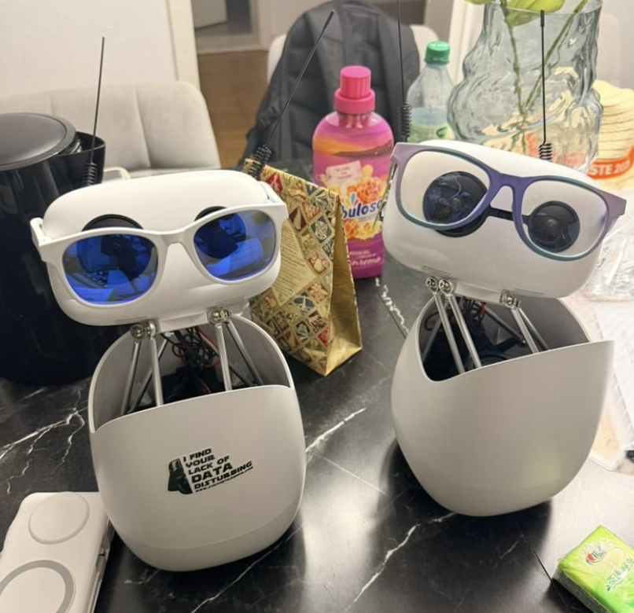
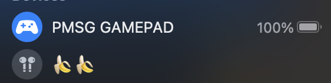
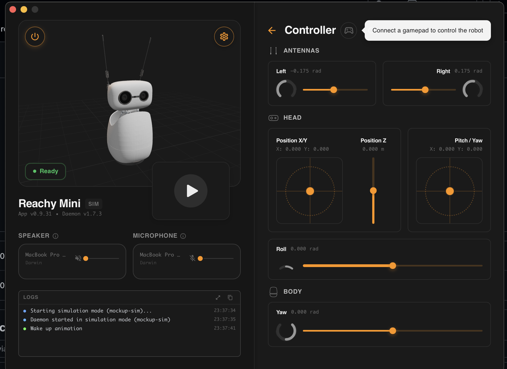

# 🎮 PMSG - GAMEPAD — Wearable Head Tracking Controller / Neck monitor

**PMSG (P.M. Smartglasses GamePad)** is a DIY wearable head-tracking controller that lets you control robots, drones, RC cars, and games using only your head movements. And technology for automotive 'fall asleep detection'." 

---

## ✨ Features

- **Head Tracking** — Full 3-axis control (X, Y, Z) using LIS3DH accelerometer
- **Haptic Feedback** — Built-in vibration motor for alerts and immersion
- **Smart LEDs** — Auto-adjusting brightness + connection status
- **Low Power Design** — Perfect for wearable and battery-powered use
- **Modular** — Works with multiple platforms (Reachy, drones, RC cars, games)
- **Future Safety Mode** — Can detect when someone is falling asleep (e.g. while driving or on boat / Airplain - ROCKET )

---

## 🖥️ Compatibility

| Platform     | Status          | Notes |
|--------------|------------------|-------|
| **Windows**  | ✅ Working      | Best experience |
| **Linux**    | ✅ Working      | Works great |
| **Android Automotivex & PCM 6.0**    | ✅ Wip      | R&D |
| **Android & Auto**    | ❌ Not working yet      | WIP OpenSource |
| **macOS**    | ❌ Not working yet | BLE gamepad support is bad hope to buy licents |
| **IOS & CarPlay**    | ❌ Not working yet |  |

> **Note:** We are actively working on better macOS support.

| Platform     | source             | Bootloader        |
|--------------|------------------|---------------------|
| ESP32C6      |   [code / source](https://github.com/Control-C/PMSG/tree/main/HeadJoy/xiao/esp32C6)     | [web bootloader](https://pmsg.2qr.at/pmsg-installer/pmsgamepad/) |

---

## 🔧 Use Cases

| Use Case              | How It Works                              | Status |
|-----------------------|-------------------------------------------|--------|
| **Reachy Mini**       | Control neck (Yaw + Pitch) with head tilt | ✅ Working |
| **Drones**            | Head tilt = Drone movement                | Planned |
| **RC Cars**           | Head movement = Steering + Throttle       | Planned |
| **Gaming - TV **       | Head tracking for immersive control       | Planned |
| **Safety / Care**     | Detect when someone is falling asleep     | ✅ Working |

Partern project: PMSG Fall-Asleep Detection System
PMSG Automotive Drowsiness Detection Flow 

---

## 🔧 Hardware

- **Main Board**: Seeed Studio XIAO ESP32-C6
- **Sensor**: LIS3DH 3-axis accelerometer (I2C)
- **LEDs**: 4x WS2812B (NeoPixel) with auto brightness
- **Haptic**: Small vibration motor on D10
- **Power**: Battery powered (wearable design)

---

## 🚀 Getting Started

### 1. Flash the Firmware
Upload the firmware using Arduino IDE (code available in this repo) or web bootloader 
https://pmsg.2qr.at/pmsg-installer/pmsgamepad/

** you will get all 4pixeldisplay blink blue and at boot vibrtion motor will buzz... ** 

### 2. Pair the Device
1. Power on your PMSG GAMEPAD
2. Connect to **"PMSG GAMEPAD"** via Bluetooth 
Now the blue leds will stop flashing 

Also via serial you can check of the movemnt sensor is working or use web bootloader ( log function to debug ) 

### 3. Use It
Tilt your head to control your robot, drone, RC car, or game!

---

## 🌐 Future Plans

- ✅ WiFi support (already possible)
- 🔜 Web API / MQTT control
- 🔜 Browser-based control panel
- 🔜 Sleep detection & safety alerts
- 🔜 Better macOS support
- 🔜 Drone & RC car integration

---

## 📸 Photos

| PMSG Gamepad                  | Example Use Case              |
|-------------------------------|-------------------------------|
|            |  |

---

## 🛠️ Contributing

We welcome contributions! Especially in:
- Drone & RC car integration
- Sleep detection algorithm
- macOS compatibility
- Web dashboard

---

## 📄 License

---
